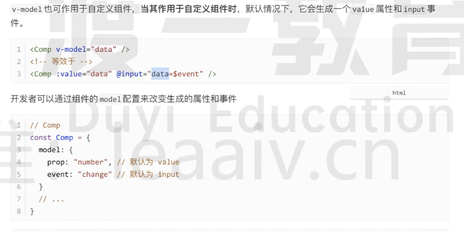

### 请阐述一下v-model的原理

v-model 既可以作用于表单元素，也可以作用于自定义组件。无论哪一种情况，v-model 都是一种语法糖，最终都会生成一个属性和事件。

当作用于表单元素时，vue 会根据表单元素的种类来生成合适的属性和事件。例如，作用于普通文本框的时候就是会生成 input 和 value。而当其作用于多选框或则复选框，就会生成 checked 和 change 事件。

