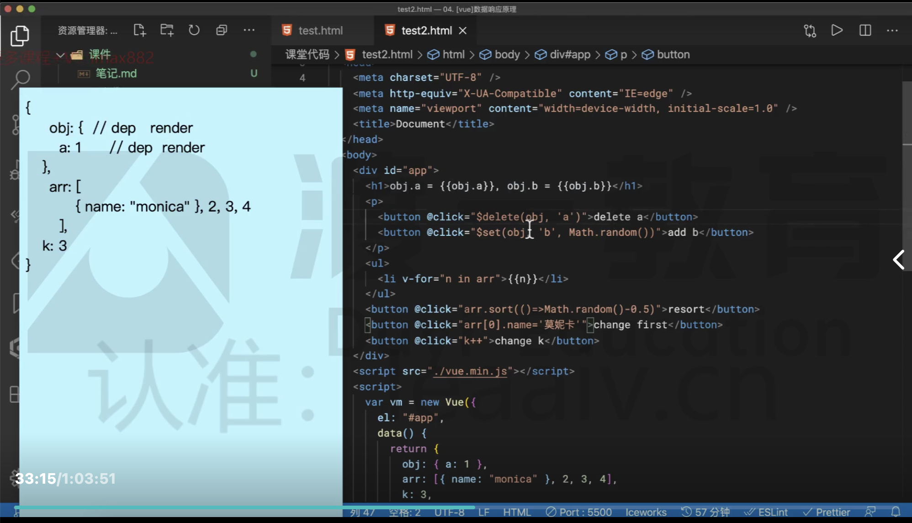
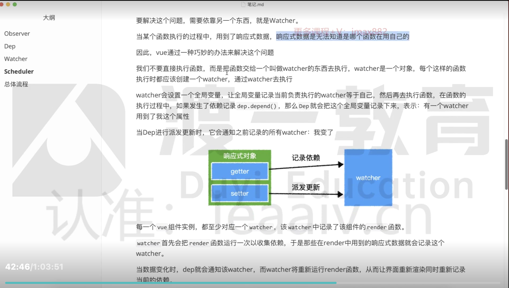
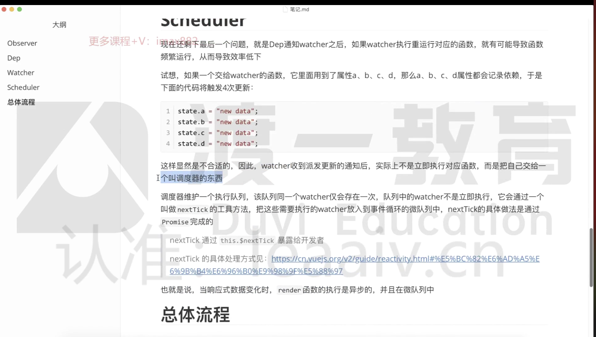
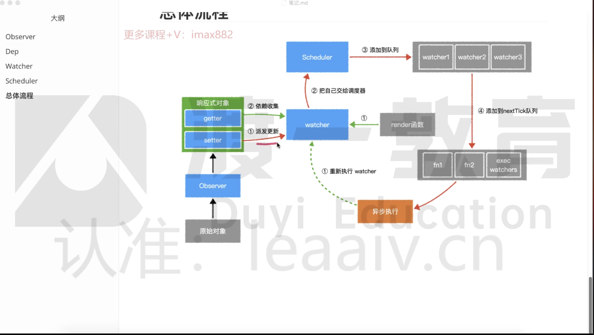

# 请阐述vue2响应式原理

**响应式数据的最终目标**，是当对象本身或对象属性发生变化时，将会运行一些函数，最常见的就是 render 函数。（其他的比如watch 里面的函数也肯定会重新执行）

在具体实现上，vue 用到了**几个核心部件：**

1. Obserever
2. Dep
3. Watcher
4. Scheduler
### Obserevr
Observe 要实现的目标非常简单，就是把一个普通对象给转成响应式对象。
为了实现这一点，Observer 把对象的每一个属性通过 Object.defineProperty 转换为带有 getter 和 setter 的属性。这样一来当访问或者设置属性的时候，vue 就可以做一些其他的事情。
可以使用 Vue.observable()简介使用这个功能。
这一件事发生在组件 beforecreate 之后，create 之前。
具体实现上，它会递归遍历对象的所有属性，以完成深度的属性转换。

> Tip： 细节可参考 test.html
> 
> 
> 1. 由于遍历时只能遍历到对象的当前属性，因此无法监测到后面动态增加或删除的属性，因此需要使用$set,$delete 这两个实例方法，来对已有响应式对象属性进行添加或删除。
> 2. 对于数组，vue 会更改他的隐式原型，来监听那些 可能改变数组内容的方法。 数组-> 自定义对象(比如：pop, push)-> Array.prototype

总之 observer的目标就是让一个对象，他属性的读取，赋值，内部的数组的变化都要被 vue 感知到。
感觉就是刚开始初始化时（beforecreate，create 之间）给 data 里面的数据通过 Object.defineProperty 来深度遍历一遍，将所有属性转换成 getter 和 setter 属性，数组的话就直接改写一下隐式原型。
### Dep
dep 就是 dependency 的缩写，表示依赖收集。
vue 会为响应式对象中的每个属性、对象本身、数组本身创建一个 dep 数组，用来记录两件事：
    1. 记录依赖：是谁再用我
    2. 派发更新：我改变了，我要通知那些用到我的人。其实就是 watcher
    其实就是 getter 的时候会依赖收集，setter 的时候，改变值的时候就会派发更新。
    

    >

#### 什么时候会有触发这个依赖收集呢？

1. 组件初次渲染时
2. 计算属性求值时
3. 自定义 watcher 监听时
4. 模板编译过程中

### Watcher

watcher 就是用来解决： Dep 如何知道是谁在用当前的这个属性的。

当某个函数执行的过程中，用到了响应式数据，响应式数据是无法知道是哪一个函数在使用该属性，比如到底是 render 函数在用我，还是别的函数。

### Scheduler

Scheduler 就是防止一下子属性改变太多，会重复调用 watch 中的 render，浪费性能。

nextTick 的原理就是 Promise.resolve().then(fn()); 这样就放进微队列中了。

### 总结
总流程图：
