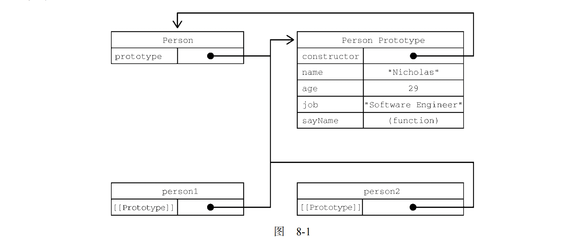

### 对象

#### 属性的特性和Object.defineProperty（）

属性的特性就是js使用一些内部特性来描述属性的特征，一般用双中括号来表示，只能使用Object.defineProprty()来改变。

Object.getOwnPropertyDescriptor(book, "year"); 这个函数可以用来读取属性的特性的。

##### 1.数据属性的4个特性

[[Configurable]] : 表示属性是否可以通过 delete 删除并重新定义，是否可以修改它的特性，以及是否可以把它改为访问器属性。

[[Enumerable]] : 表示属性是否可以被for in 循环遍历。

[[Writable]]: 表示属性的值是否可以被修改。

[[Value]]: 包含属性实际的值。包含一个保存数据值的位置。值会从这个位置读取，也会写入到这个位置。

##### 2. 访问器属性

[[Configurable]]：同上

[[Enumerable]]: 表示属性是否可以通过for-in循环来返回。

[[Get]]：获取函数，在读取(调用值)属性时调用。默认值为 undefined。 

[[Set]]：设置函数，在写入（设置值）属性时调用。默认值为 undefined。

#### 对象的创建

```js
// 普通的创建对象 工厂模式
function createPerson (name, age) {
    let object = new Object();
    object.name = name;
    object.age = age;
    object.sayName = function() {
        console.log(this.name);
    } 
  	return object;
}
// 构造函数
function Person(name, age) {
    this.name = name;
    this.aghe = age;
    this.sayName = function() {
       console.log(this.name);
    }
}
```

##### 使用构造函数必须要用new操作符来新建对象

#### 其实看构造函数的代码就能看出来 ，其实new是有额外操作的 

#### new 操作符创建对象的五个步骤：

1.  给实例分配空间。
2. 将实例对象的[[Prototype]]（杠杠proto杠杠）属性指向构造函数的原型。
3. 将构造函数里面的this指向实例对象。
4. 执行构造函数里面的代码，相当于给新实例添加新属性。
5. 如果有返回值就返回返回值，没有的话就返回实例对象给变量。


### 原型和原型链
##### 原型对象（Prototype）


#### 构造函数的主要问题是   在构造函数内定义的方法会在我们创建的每一个实例中都创建一遍。也就是说Person1和Person2中的sayName不是同一个Function实例。其实可以通过把函数定义转移到函数外部来解决。this.sayName = Sayname();  但是这样会在对象外面定义很多函数，比较混乱，所以设计了原型。而且也不能解决对象标识的问题。

##### 原型：每一个函数都有一个prototype属性, 这个属性指向的就是一个对象。这个对象就用来装要给实例共享的属性和方法。

##### 关系总结

构造函数.prototype=======> 原型对象

原型对象.constructor======> 构造函数

实例对象.【【Prototype】】=======> 原型对象

实例的【【Prototype】】是一个特性，脚本中是不能访问的，所以主流浏览器都暴露了一个__proto__来替代Prototype, 以便我们访问原型对象。

Person.prototype.isPrototypeOf(Person1) // true

##### 原型的层级：

1. 在通过对象来访问属性的时候，会按照属性的名称开始搜索，如果实例本身没有的话，就回去原型上找。这就是多个原型共享属性和方法的原理。
2. 实例上的同名属性会遮蔽原型上的属性。

可以使用hasOwnProperty()方法确定某个属性是在实例上还是在原型上。

##### 原型的问题

1. 弱化了向构造函数传递参数的能力？？？这个应该是子类实例化的时候不能给父类构造函数传参
2. 包含引用值的属性会被所有的实例共同修改。

#### 继承

#### 1. 原型链继承

##### 原型链的原理： 每一个构造函数的实例的[[Prototype]]都会指向原型对象，所有我们让子类的原型为父类的实例，那么子类的原型对象的[[Prototype]]就指向父类构造函数的原型对象了。

```js
//其实就这一句代码
SubType.prototype = new SuperType();
```


**注：** 其实任何引用类型都继承自Object。

##### 原型链的问题：原型中包含的引用值会在所有实例间共享。

##### 子类型在实例化时不能够给父类型的构造函数传参。

#### 2.盗用构造函数

##### 原理： 在子类构造函数中调用父类的构造函数。

```js
function SubType () {
    SuperType.call(this, arguments);
    ....
}
```

盗用构造函数就是把父类的代码全部在自己这儿全执行一遍，子类跟父类其实没啥关系。

##### 缺点：没有原型，函数不能复用。

#### 3. 组合继承

##### 原理：我们可以将要共享给子类的方法放到父类的原型上，让子类通过原型链的方式来继承这些方法，然后将不想让子类能够随意改变的属性（比如一些值是引用类型的属性）放到构造函数中，让子类通过盗用构造函数的方式自己实例化一份。

```js
function SuperType(name) {
    this.name = name;
    this.color = ["red", "blue", "black"];
}
SuperType.prototype.sayName = function() {
    this.console(this.name);
}
function Subtype(name, age) {
    Super.call(this, name);  // 继承父类中的基本属性。
    this.age = age;
}
// 继承父类原型中的共享方法。
Subtype.prototype = new SuperType();
```

#### 4.原型式继承

##### 原理： 理论上就是原型的方式，只是封装了一下。

```js
function object(o) {
    function F() {}  // 临时创建一个构造函数
    F.prototype = o;  // 将F的原型指向传入的对象
    return new F(); 
}

let person = {name:"daqige",friends:["d1", "d2"]}
let person2 = object(Person);
let person1 = object(Person);
// 这样一来，person1就是 F的实例了，所以p1的[[Protype]]就指向F的原型，然后F的原型就是o,所以p1的原型就指向o, 同理p2也是，那么p1 p2就共享person里面的引用值类型了(friends);
```

##### 其实调用object的结果就相当于person1  = new Person(); 且这个Person构造函数所有属性全在原型中。也就是说 let person1 = object(person) ===> person1.[[Prototype]] = person;  而person是Person的原型，而且我们可以不关注Person这个函数。

##### 突然发现原型式继承有个好处：也就是说我们直接继承了person里面的属性，而使用 SubType.prototype = new SuperType();  原型链是连上了，但是原型上也会多了SuperType构造函数里面的的属性。

ES5将这个直接变为Object.create()方法了。但是可以多加一个参数，第二个参数跟Object.defineProperty()的第二个参数类似，就是你想改变的对象的属性。

##### 这种方式适合我们不想给一个对象建立构造函数，然后对象间还想要互相共享信息的场合。

#### 5. 寄生式继承

##### 原理：就是原型式继承，然后给我们的实例对象再加一些属性。

```js
function createAnother(origin) {
    let clone = object(origin); //这句代码===》 clone.[[Prototype]]=origin
	let clone.sayHi = function(){ console.log("Hi");}
    return clone;
}
```

这就是加了一个方法。感觉就是当后面实例化的对象都要有这个属性的话，有点用。这里的添加的属性和方法其实就是不让它在原型里面，方便每个实例对象都能独享。

#### 6.寄生式组合继承

##### 其实组合式继承存在效率问题，就是子类构造函数里面有name,colors, 然后子类的原型里面也有name,colors.

```js
// 第一次调用SuperType
SubType.prototype = new SuperType();
// 第二次调用SuperType 就是子类创建实例时，会调用子类构造函数。
function SubType(name) {
   SuperType.call(this, name) //这里就是第二次调用  
}

// 所以使用函数inheritPrototype()
// 将第一次原型赋值为父类的实例改了
inheritPrototype(SubType, SuperType); // 这就行了

```

#### 完整写一遍寄生式组合继承

```js
function SuperType (name) {
    this.name = name;  
	this.colors = ["red", "blue", "black"];  
} 
SuperType.prototype.sayName = function(){console.log(this.name)}

function SubType(name, age){
	SuperType.call(this, name);    
	this.age = age;
}
// 组合继承的原型链接上方式： SubType.prototype = new SuperType();
function InhritPrototype(SuperType, SubType) {
    // 其实我们要干的事是 SubType.prototype.[[Protype]] = SuperType.protype;
	// 但是由于不能操作[[Protype]], 所有我们需要一个中介。
    function F (){};
    F.prototype = SuperType.prototype;
    SubType.prototype = new F(); // 这就连上了！！！！其实也是因为F；里面什么属性赋值都没有，所以不会带来额外的多于属性。	     
}
InhritPrototype(SuperType, SubType);
let person1 = new SubType("daqige", 12);
person1.sayName();

```


