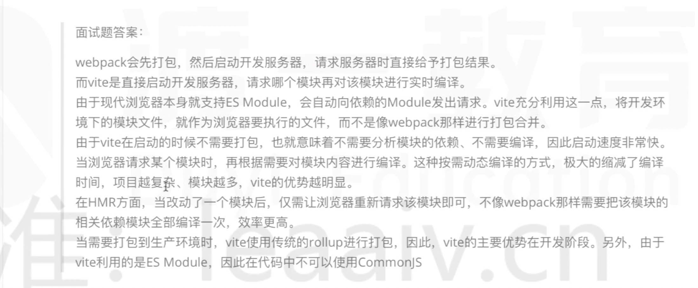

对比 webpack，vite 为啥这么快？

webpack是把所有的模块，打成 chunck 以后再启动 dev-server，来返回打包好的 chuck 的，所以他其实涉及到对模块的编译，打包。如果有修改，那么 webpack会重新 build，重新收集依赖，编译、打包，生成的新的 chunck ，chuck hash 改变后，浏览器还得重新请求。

而vite 是利用了现代浏览器原生就支持 es moudle 的特点，type=module,几乎不涉及到编译，直接启动了一个本地服务器，直接把你的所有模块返回给浏览器，没有编译就特别快，而且你修改了某个文件，只有这一个文件会被重新请求，不涉及重新编译，打包，所以就快了很多。但是这只是开发环境，线上部署的话，你还是得考虑兼容性，该编译的编译，改打包的打包。

> 注意：
>
> 1. 可以推论出，就是模块越多，webpack 就打包的越慢，vite 的优势就越明显。
>
> 2. 其实 vite 也涉及到编译，
>
>    1. vite在一些 js 文件中还是有一些简单加工的，比如把 import from 'vue' 路径改成import from '@modules/vue.js'的，包括把相对路径改成绝对路径。方便开发服务器去对应的地方请求模块.
>
>    2. .vue 文件也还是会被编译成 js,不请求就不管，用到了开发服务器就再编译，返回
>
>       