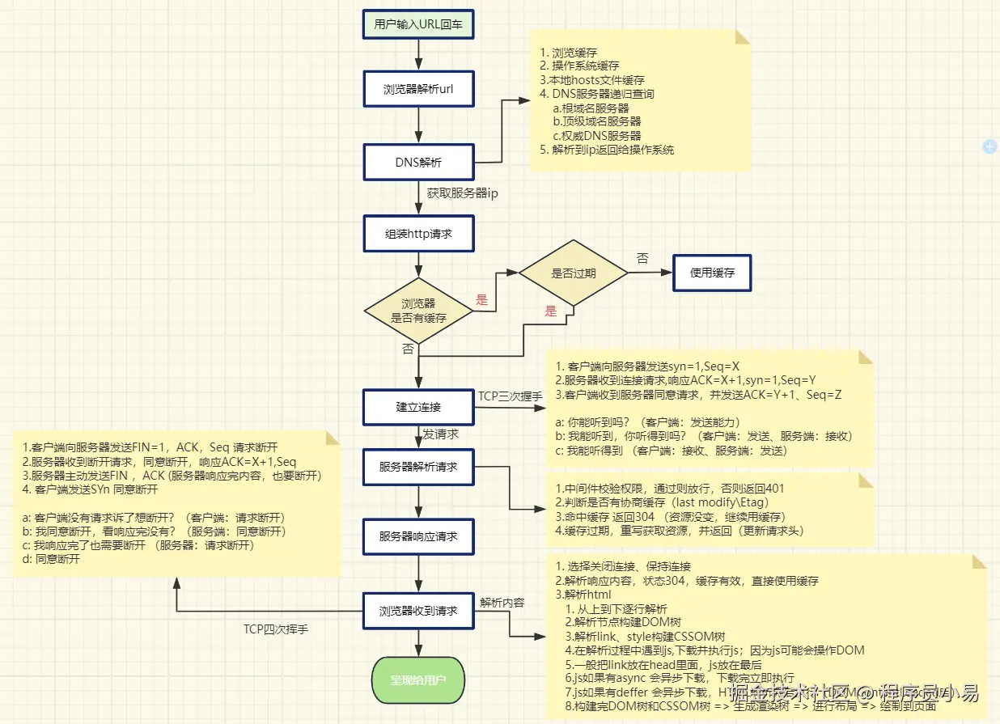

### 从地址栏输入url按下回车后发生了什么？
#### 1.url的解析
浏览器会对url进行解析，包括协议、域名、端口、path、query
#### 2.DNS解析
浏览器会对域名进行解析，将域名转化为ip
#### 3.建立tcp链接
#### 4.发送http请求
浏览器会向服务器发送HTTP请求，包括请求行、请求头、请求体等
#### 5.服务器处理请求&响应结果
服务器会根据请求的路径和参数，返回相应的资源
#### 6.断开TCP连接
浏览器与服务器断开TCP连接，包括四次挥手。
#### 7.浏览器收到html后，解析html
浏览器会解析HTML，构建DOM树。
#### 8.构建CSSOM树
浏览器会根据DOM树和CSSOM树，构建渲染树。
#### 9.布局渲染树
浏览器会根据渲染树，计算每个节点的位置和大小。
#### 10.绘制渲染树
浏览器会根据渲染树，绘制页面。
