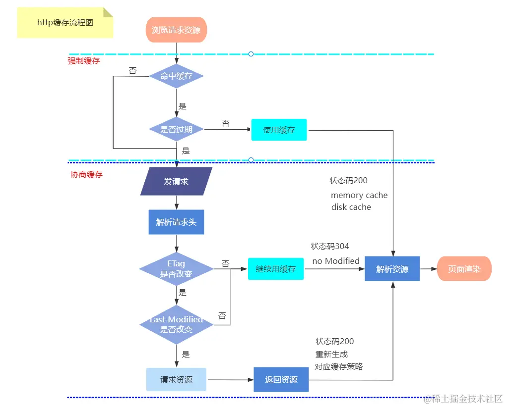

### http缓存
HTTP缓存是指在客户端（如浏览器）或者代理服务器（如CDN）中存储之前获取的Web资源的副本，当客户端或代理服务器再次请求该资源时，直接从本地缓存中获取，避免了重复的网络请求和服务器响应。常见的HTTP缓存包括强制缓存和协商缓存。 
http缓存也称浏览器缓存，就是：服务器通过header头告诉浏览器是否使用缓存，使用什么样的缓存规则？我们先认识一下缓存的优先级和请求头。

#### 强缓存
强缓存主要使用Expires、Cache-Control 两个头字段，两者同时存在Cache-Control优先级更高。当命中强缓存的时候，客户端不会再求，直接从缓存中读取内容，并返回HTTP状态码200。这里就是无论 服务端的资源有没有发生改变，没有过期之前，都不会重新发送请求。

##### Expries
Expires：绝对时间，表明直到这个时间为止，都不需要找我。注意避坑：时间格式为：格林尼治时间：GMT。这是http1.0的产物，存在问题，所以在1.1版本推出了Cache-Control。
先来看代码的实现：在请求index.css的时候给设置了Expires请求头。下面是第一请求index.css和第一次请求的浏览器截图。第一次请求图片，返回的状态码是200。表示改资源是从服务器读取的。
##### Expires的不足
最致命的问题是：过期时间设置的是一个绝对时间，它没有发请求，在本地判断是否过期，用的客户端的时间和响应的Expires做判断。那么问题就来了：假如客户端的时间被修改了、就算时间没有被修改，也存在跨时区问题，不就乱套了么？所以Cache-Control还是很有必要滴。

##### Cache-Control
：相对时间, 响应后N秒，资源保持新鲜，如1分钟之内，都不要找我，max-age="60",单位为秒。我们通过max-age设置的强制缓存,设置了max-age 在没有到期之前，服务器也是没有接收到请求 的，直接在前端拿的缓存，并且返回的是200，接下来，去看看协商缓存。

#### 协商缓存
协商缓存：顾名思义，它没有强制缓存那么硬气，需要去和服务端协商，到底用缓存？还是重新访问资源？协商缓存是希望通过对比文件的最后一次修改时间、文件内容hash来判断。这里涉及的两组header头：
##### Last-Modified / If-Modify-Since
浏览器第一次请求一个资源的时候，服务器返回的header中会加上Last-Modify，Last-Modify是一个时间标识该资源的最后修改时间，例如Last-Modify: Thu,31 Dec 2037 23:59:59 GMT。
当浏览器再次请求该资源时，request的请求头中会包含 if-modified-since，该值为缓存之前返回的Last-Modify。服务器收到if-modified-since后，根据资源的最后修改时间判断是否命中缓存。
如果命中缓存，则返回304，并且不会返回资源内容，并且不会返回Last-Modify

##### Etag和If-None-Match
Etag/If-None-Match返回的是一个校验码。ETag可以保证每一个资源是唯一的，资源变化都会导致ETag变化。服务器根据浏览器上送的If-None-Match值来判断是否命中缓存。
当服务器返回304 Not Modified的响应时，由于ETag重新生成过，response header中还会把这个ETag返回，即使这个ETag跟之前的没有变化。
